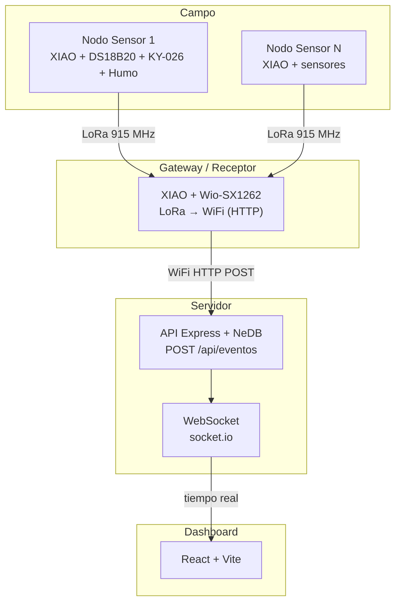

# Diagrama en bloques del sistema

```mermaid
graph TB
    subgraph Campo["Campo"]
        NS1["Nodo Sensor 1<br/>XIAO + DS18B20 + KY-026 + Humo"]
        NS2["Nodo Sensor N<br/>XIAO + sensores"]
    end
    subgraph Gateway["Gateway / Receptor"]
        G["XIAO + Wio-SX1262<br/>LoRa → WiFi (HTTP)"]
    end
    subgraph Servidor["Servidor"]
        API["API Express + NeDB<br/>POST /api/eventos"]
        WS["WebSocket<br/>socket.io"]
    end
    subgraph Dashboard["Dashboard"]
        D["React + Vite"]
    end

    NS1 -->|"LoRa 915 MHz"| G
    NS2 -->|"LoRa 915 MHz"| G
    G -->|"WiFi HTTP POST"| API
    API --> WS
    WS -->|"tiempo real"| D
```
