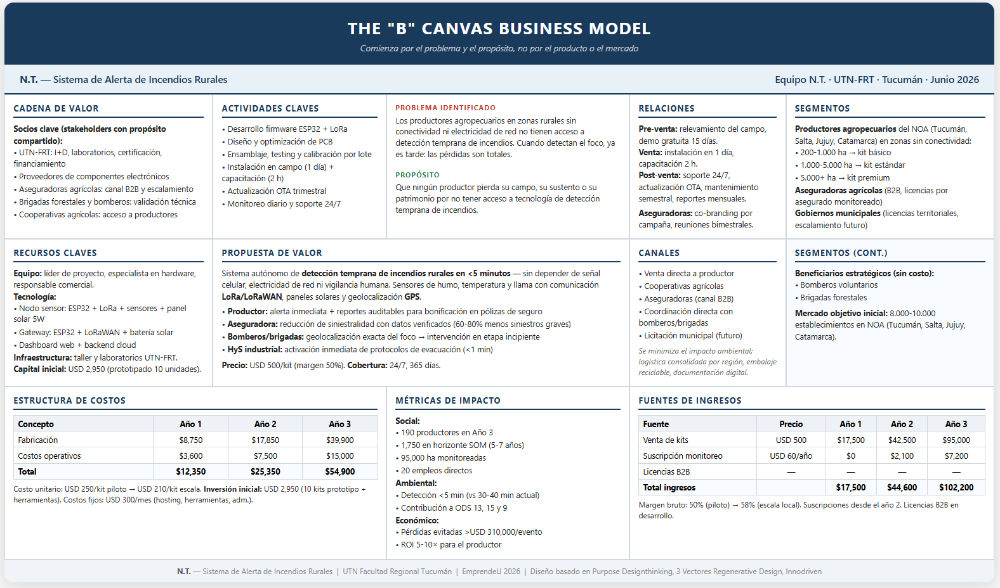

# EmprendeU

## Concurso de Emprendimientos Universitarios

---

### Entregable N° 2

#### Módulo 3 — Modelo de Negocio

---

|                 |                                                             |
| --------------- | ----------------------------------------------------------- |
| **Categoría**   | Universitario                                               |
| **Institución** | Universidad Tecnológica Nacional, Facultad Regional Tucumán |
| **Provincia**   | Tucumán                                                     |
| **Fecha**       | Junio 2026                                                  |

---

| Integrantes              |                             |
| ------------------------ | --------------------------- |
| Mario Roberto Quiroga    | quirogamario642@gmail.com   |
| Jeremias Mastafa Nazar   | jeremiasmastafa72@gmail.com |
| Gonzalo Fabricio Lescano | Glescano002@gmail.com       |
| Nicolas Pinto            | nicolaspinto2805@gmail.com  |

---

## 1. Idea de Negocio

### 1.1 Propuesta de Valor

Sistema autónomo de detección temprana de incendios rurales que alerta al productor agropecuario en menos de 5 minutos —sin depender de señal celular, electricidad de red ni vigilancia humana. Combina sensores de humo, temperatura y llama con comunicación LoRa/LoRaWAN, paneles solares y geolocalización GPS. A diferencia de las soluciones existentes (Faros de Conservación, satélites, Pampa 4, Telecom Agro IoT), está diseñado específicamente para productores individuales en zonas rurales sin conectividad, a un costo accesible (USD 500/kit). Genera reportes digitales auditables que permiten bonificaciones en pólizas con aseguradoras.

### 1.2 Clientes Objetivo

El segmento principal son productores agropecuarios medianos y grandes (>200 ha) en zonas del NOA (Tucumán, Salta, Jujuy, Catamarca) con conectividad limitada o nula. Se estiman 8.000-10.000 establecimientos en el mercado objetivo inicial. Se subsegmentan en pequeño-mediano (200-1.000 ha), mediano-grande (1.000-5.000 ha) y grandes productores/agroindustrias (5.000+ ha). Como clientes secundarios B2B: aseguradoras agrícolas (licencias), y a futuro gobiernos municipales (licencias territoriales). Los bomberos voluntarios y brigadas forestales son beneficiarios estratégicos sin costo.

### 1.3 Ventaja Competitiva / Diferenciación

Ninguna solución actual cumple simultáneamente con las cinco condiciones que definen nuestro sistema: detección automática en etapa incipiente, funcionamiento autónomo sin conectividad celular ni eléctrica, alerta directa al productor con geolocalización GPS, costo accesible para el productor mediano (USD 500/kit) y cobertura 24/7. Los competidores existentes —Faros de Conservación (~USD 500.000 por torre), sistemas satelitales (resolución ≥375 m, latencia ≥3 h), Pampa 4 (depende de red LoRaWAN pública) y Telecom Agro IoT (requiere 4G)— están orientados a gobiernos, grandes empresas o requieren infraestructura de red que no existe en las zonas rurales profundas.

### 1.4 Modelo de Ingresos

El modelo genera ingresos por tres vías: venta de kits de detección a USD 500/unidad con margen bruto del 50%, suscripción anual de monitoreo a USD 60/año desde el año siguiente a la compra, y licencias B2B para aseguradoras. La proyección realista estima 35 kits en el Año 1 (USD 17.500), 85 en el Año 2 (USD 44.600) y 190 en el Año 3 (USD 102.200). El punto de equilibrio es de apenas 2 kits por mes, alcanzable desde el segundo trimestre del Año 1. El flujo de caja es positivo desde el primer año gracias al bootstrapping: el equipo no percibe sueldos gerenciales y reinvierte la totalidad de las utilidades.

---

## 2. Modelo de Negocio Canvas B

### 2.1 Problema y Propósito

Con más de 10.000 incendios rurales por año en Argentina (CPIA, 2026) y 55.870 hectáreas quemadas solo en Tucumán durante la zafra 2025 (EEAOC, 2025), los productores en zonas sin conectividad enfrentan un riesgo al que llegan siempre tarde. Frente a esto, N.T. persigue un propósito claro: que ningún productor pierda su campo, su sustento o su patrimonio por no tener acceso a tecnología de detección temprana de incendios. El proyecto nace de la realidad tucumana para democratizar la prevención y pasar de un enfoque reactivo a uno preventivo.

### 2.2 Propuesta de Valor

| Segmento | Beneficio principal | Indicador |
|----------|-------------------|-----------|
| **Productor agropecuario** | Detección en <5 min sin señal celular ni electricidad de red | USD 500/kit, autonomía energética total |
| **Aseguradora agrícola** | Reducción de siniestralidad con reportes digitales auditables | Potencial de 60-80% menos siniestros graves |
| **Bomberos y brigadas** | Geolocalización GPS exacta del foco | Intervención en etapa incipiente con recursos ligeros |
| **Responsable de HyS** | Activación inmediata de protocolos de evacuación | De >10 min a <1 min |

### 2.3 Segmentos, Canales y Relaciones

| Segmento | Subsegmento / Rol | Canal principal | Tipo de relación |
|----------|------------------|----------------|------------------|
| **Productor** | 200-1.000 ha → kit básico. 1.000-5.000 ha → kit estándar. 5.000+ ha → kit premium | Venta directa / cooperativa / aseguradora | Personalizada, soporte técnico continuo |
| **Aseguradora** | Cliente B2B. Licencias por asegurado monitoreado | Comercial B2B | Contractual, reportes trimestrales auditables |
| **Bomberos / brigadas** | Beneficiario estratégico (sin costo) | Coordinación directa | Colaboración técnica y validación en terreno |
| **HyS industrial** | Prescriptor en ingenios y agroindustrias | Venta directa corporativa | Técnica, cumplimiento normativo |
| **Gobierno / municipio** | Cliente institucional (escalamiento futuro) | Licitación / convenio | Contractual, monitoreo territorial |

La relación se estructura en tres etapas: pre-venta (relevamiento del campo, demostración gratuita de 15 días), venta (instalación en 1 día, capacitación de 2 horas) y post-venta (soporte 24/7, actualización OTA, mantenimiento semestral, reportes mensuales). Con las aseguradoras se suma co-branding por campaña y reuniones bimestrales.

### 2.4 Socios, Actividades y Recursos

**Socios clave:**
- UTN-FRT: I+D, laboratorios para certificación, acceso a financiamiento
- Proveedores de componentes: cadena de suministro para fabricación
- Aseguradoras agrícolas: canal de distribución y escalamiento comercial
- Brigadas forestales y bomberos: validación técnica y prescripción
- Cooperativas agrícolas: acceso a productores asociados

**Actividades clave:**
- Desarrollo de firmware ESP32 + LoRa (sprints continuos)
- Diseño y optimización de PCB por iteración
- Ensamblaje, testing y calibración por lote
- Instalación en campo (1 día/cliente) y capacitación
- Actualización OTA trimestral y monitoreo diario

**Recursos clave:**
- Equipo: líder de proyecto, especialista en hardware, responsable comercial
- Tecnología: nodo sensor (ESP32 + LoRa + sensores + panel solar 5W), gateway (ESP32 + LoRaWAN + batería solar), dashboard web, backend cloud
- Infraestructura: taller y laboratorios en UTN-FRT
- Capital: USD 2.950 (prototipado 10 unidades) + USD 3.000 capital de trabajo

### 2.5 Estructura de Costos e Ingresos

| Concepto | Año 1 | Año 2 | Año 3 |
|----------|:-----:|:-----:|:-----:|
| Kits vendidos | 35 | 85 | 190 |
| Ingreso por hardware (USD 500/kit) | USD 17.500 | USD 42.500 | USD 95.000 |
| Ingreso por suscripciones | USD 0 | USD 2.100 | USD 7.200 |
| **Total ingresos** | **USD 17.500** | **USD 44.600** | **USD 102.200** |
| Costo de fabricación | USD 8.750 | USD 17.850 | USD 39.900 |
| Costos operativos | USD 3.600 | USD 7.500 | USD 15.000 |
| **Utilidad bruta** | **USD 5.150** | **USD 19.250** | **USD 47.300** |
| *Margen* | *29%* | *43%* | *46%* |

Cada kit se vende a USD 500. El costo de fabricación escala con el volumen: USD 250/kit en la fase piloto (Año 1, 35 unidades), USD 210/kit al alcanzar escala local (Año 2 en adelante). Los costos fijos son de USD 300/mes (hosting, herramientas, administración). Las suscripciones (USD 60/año) se cobran desde el año siguiente a la compra. La inversión inicial de USD 2.950 cubre el prototipado de 10 unidades. El punto de equilibrio es de 2 kits por mes, alcanzable desde el segundo trimestre del Año 1.

### 2.6 Métricas de Impacto

En el plano social, se proyecta alcanzar 190 productores en el Año 3 y 1.750 en el horizonte SOM (5-7 años), con 95.000 hectáreas monitoreadas y 20 empleos generados. En el plano ambiental, el sistema reduce el tiempo de detección de 30-40 minutos a menos de 5 y contribuye a los ODS 13 (Acción Climática), 15 (Ecosistemas Terrestres) y 9 (Industria e Innovación). En el plano económico, las pérdidas evitadas por evento grave superan los USD 310.000 con un retorno de inversión estimado de 5 a 10 veces para el productor en la primera temporada.

---

## 3. Aprendizajes y Conclusiones

### 3.1 Validación de Hipótesis

Las entrevistas realizadas con los cuatro stakeholders clave —productores agropecuarios, bomberos voluntarios, aseguradoras agrícolas y responsables de Higiene y Seguridad industrial— confirmaron la hipótesis central del proyecto: **no existe una solución accesible de detección temprana de incendios para el productor rural sin conectividad**. Los bomberos validaron que la geolocalización GPS es el factor más crítico para reducir el tiempo de respuesta. Las aseguradoras expresaron interés concreto en el modelo B2B de licencias con reportes auditables, siempre que se demuestre la eficacia del sistema en terreno. Los productores confirmaron el dolor de "enterarse siempre tarde" y la disposición a pagar por una solución autónoma.

### 3.2 Aprendizajes Clave

1. **El problema es real y urgente.** La magnitud de los incendios en Argentina (+10.000/año) y particularmente en Tucumán (55.870 ha en 2025) no tiene correlación con la oferta de soluciones disponibles para el productor individual.
2. **El gap de mercado está claramente identificado.** Ningún competidor cubre simultáneamente detección temprana, autonomía de conectividad y costo accesible. Este espacio está vacante.
3. **La estacionalidad es un factor de riesgo.** Las ventas se concentran en Q2-Q3, lo que exige planificación financiera para sostener los meses sin ingresos (Q1).
4. **El canal asegurador es la llave del escalamiento.** Si se logra homologar el sistema con una aseguradora, el crecimiento puede acelerarse significativamente sin inversión en captación de clientes.
5. **El bootstrapping inicial es viable pero limitante.** El equipo puede absorber el desarrollo técnico, pero la producción y la logística requerirán financiamiento externo (ANR, Fondo Semilla) para escalar más allá de las 190 unidades anuales.

### 3.3 Próximos Pasos

1. **Fabricación de 10 kits piloto** (Fase 1) con la inversión inicial de USD 2.950, utilizando los laboratorios de UTN-FRT para ensayos de estanqueidad, estrés térmico y validación de radiofrecuencia.
2. **Instalación en campos de prueba** en Lules y Tafí Viejo (Tucumán) para validación con productores y bomberos durante la temporada crítica (Q3).
3. **Presentación a aseguradoras** para iniciar conversaciones de homologación y modelo B2B, utilizando las métricas recolectadas en el piloto.
4. **Postulación a financiamiento** (SECyT UTN, IDEP Tucumán ANR, Fondo Semilla Nacional) para la Fase 2 de escalamiento a 100+ unidades.
5. **Desarrollo del dashboard web y app mobile** para la plataforma de monitoreo en tiempo real.

---

## 4. Datos Actualizados del Equipo

### Información General

| Campo                 | Detalle                                                     |
| --------------------- | ----------------------------------------------------------- |
| **Categoría**         | Universitario                                               |
| **Provincia**         | Tucumán                                                     |
| **Institución**       | Universidad Tecnológica Nacional, Facultad Regional Tucumán |
| **Nombre del equipo** | N.T.                                                        |

### Integrante 1

| Campo    | Valor                     |
| -------- | ------------------------- |
| Apellido | Quiroga                   |
| Nombre   | Mario Roberto             |
| Correo   | quirogamario642@gmail.com |
| DNI      | 44637851                  |
| Celular  | +54 9 381 697-1422        |

### Integrante 2

| Campo    | Valor                       |
| -------- | --------------------------- |
| Apellido | Mastafa Nazar               |
| Nombre   | Jeremias                    |
| Correo   | jeremiasmastafa72@gmail.com |
| DNI      | 43965268                    |
| Celular  | +54 9 381 300-3465          |

### Integrante 3

| Campo    | Valor                 |
| -------- | --------------------- |
| Apellido | Lescano               |
| Nombre   | Gonzalo Fabricio      |
| Correo   | Glescano002@gmail.com |
| DNI      | 44583436              |
| Celular  | +54 9 381 560-0431    |

### Integrante 4

| Campo    | Valor                      |
| -------- | -------------------------- |
| Apellido | Pinto                      |
| Nombre   | Nicolas                    |
| Correo   | nicolaspinto2805@gmail.com |
| DNI      | 44814223                   |
| Celular  | +54 9 381 340-6068         |

---

## 5. Referencias a Documentos del Proyecto

Los siguientes documentos forman parte del repositorio completo del proyecto y profundizan en los temas tratados en este entregable:

### Modelo de Negocio

| Documento | Ruta | Contenido |
| --------- | ---- | --------- |
| Descripción del Problema | `Problema_y_contexto/descripcion_problema.md` | Contexto y magnitud del problema de incendios rurales en Argentina y Tucumán |
| Propósito | `Modelo_de_negocio/proposito.md` | Razón de ser del proyecto, motivación del equipo y cambio que se busca generar |
| Propuesta de Valor | `Modelo_de_negocio/propuesta_valor.md` | Beneficios diferenciales del sistema para cada segmento |
| Segmentos de Clientes | `Modelo_de_negocio/segmentos_clientes.md` | Perfil detallado de productores, aseguradoras, brigadas |
| Mercado y Competencia | `Modelo_de_negocio/mercado.md` | Tamaño del mercado, tendencias y benchmarking competitivo |
| Canales y Relación con Clientes | `Modelo_de_negocio/canales_relacion.md` | Canales de distribución y estrategia de relación con cada segmento |
| Ingresos y Costos | `Modelo_de_negocio/ingresos_costos.md` | Fuentes de ingresos, estructura de costos fijos y variables |
| Operaciones | `Modelo_de_negocio/operaciones.md` | Recursos, actividades clave y socios estratégicos |
| Canvas del Modelo de Negocio | `Modelo_de_negocio/canvas_modelo_negocio.pdf` | Modelo de negocio completo en formato Canvas |

### Finanzas y Viabilidad

| Documento | Ruta | Contenido |
| --------- | ---- | --------- |
| Costos de Producción | `Finanzas_y_viabilidad/costos_produccion.xlsx` | Desglose detallado de costos unitarios y totales |
| Necesidades de Inversión | `Finanzas_y_viabilidad/necesidades_inversion.md` | Inversión inicial requerida y fuentes de financiamiento |
| Proyecciones Financieras | `Finanzas_y_viabilidad/proyecciones.md` | Proyecciones financieras a 3-5 años |
| Punto de Equilibrio | `Finanzas_y_viabilidad/punto_equilibrio.md` | Análisis de punto de equilibrio y rentabilidad |

### Impacto y Sostenibilidad

| Documento | Ruta | Contenido |
| --------- | ---- | --------- |
| Métricas de Impacto | `Impacto_y_sostenibilidad/metricas_impacto.md` | Indicadores de impacto social, ambiental y económico del proyecto |
