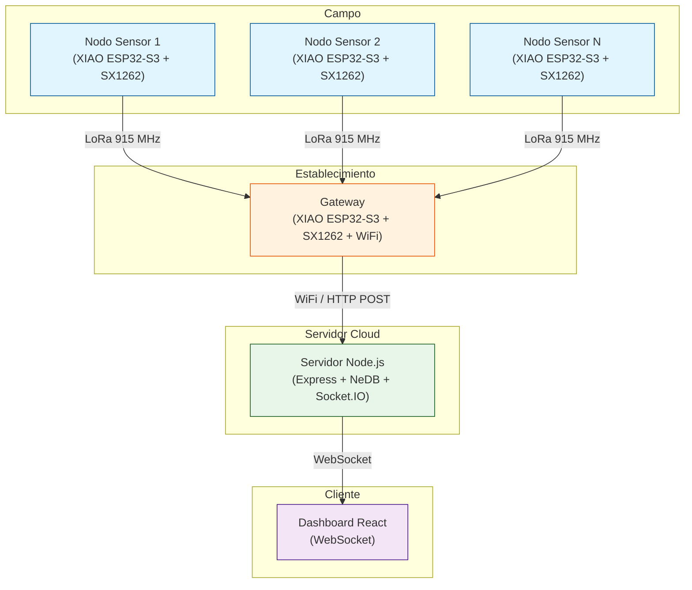
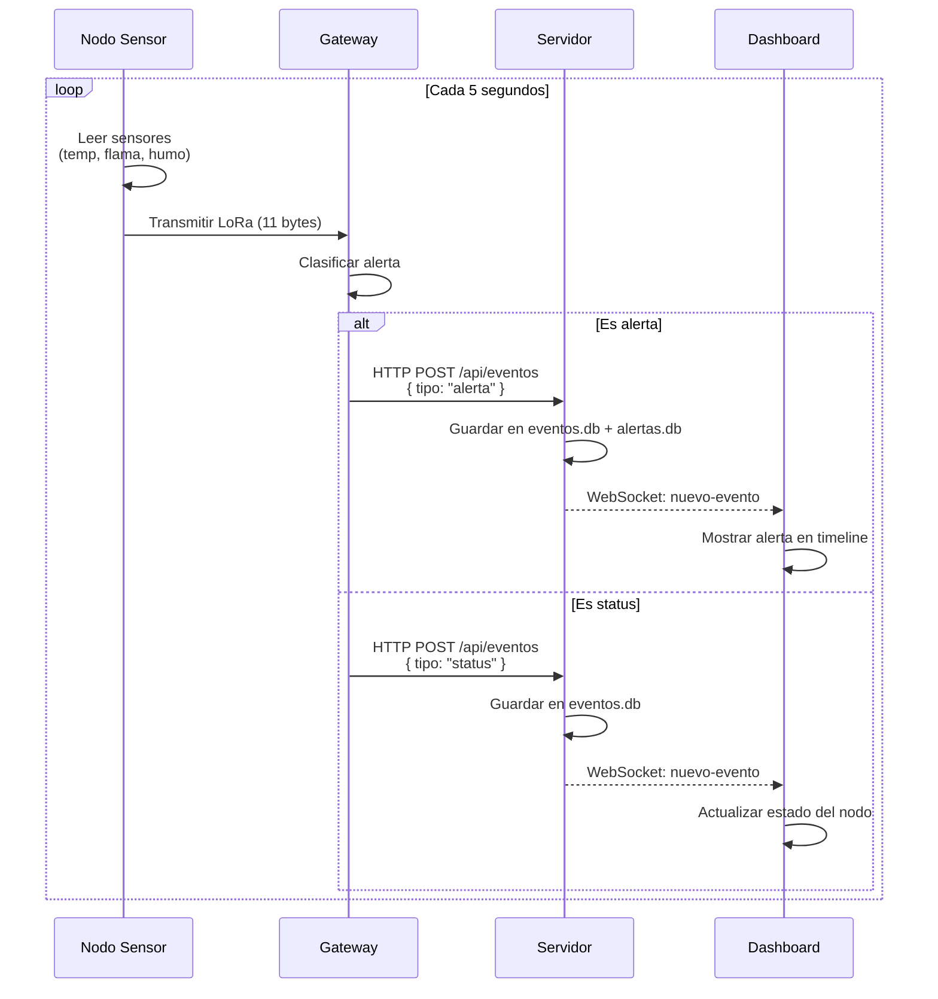
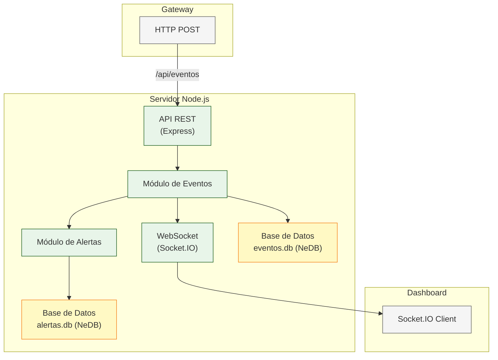
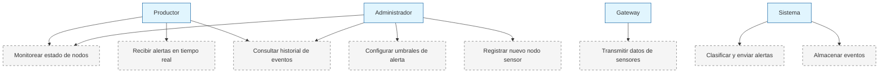
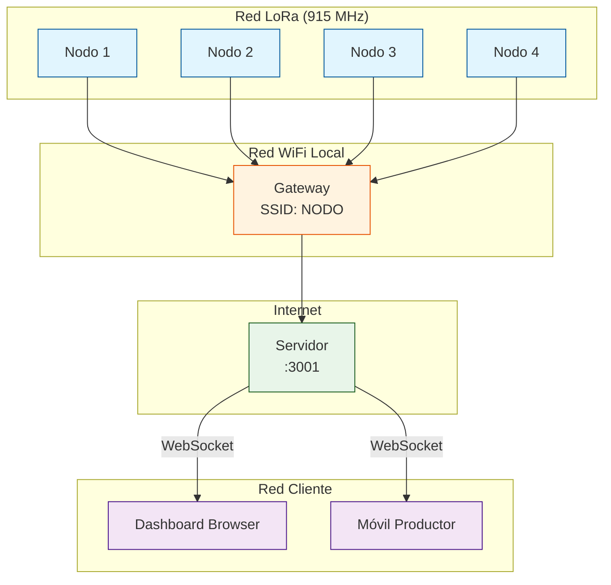

# Diagramas del Sistema

**ALPA — Sistema de Alerta de Incendios Rurales**

**Fecha:** Junio 2026
**Versión:** 1.0

## 1. Introducción

Este documento recopila los diagramas de arquitectura y diseño del sistema. Los diagramas están escritos en sintaxis Mermaid para facilitar su edición y versionado. Para generar imágenes PNG/ SVG, puede utilizarse el script `Herramientas/render_mermaid.py`.

**Convenciones de notación:**
- Diagramas de despliegue: C4 / UML Deployment
- Diagramas de secuencia: UML
- Diagramas de componentes: UML Component
- Diagramas de casos de uso: UML Use Case

## 2. Lista de diagramas

### 2.1 Diagrama de despliegue

**Descripción:** Nodos físicos, software y conexiones de red del sistema.

**Código Mermaid:**



### 2.2 Diagrama de secuencia

**Descripción:** Flujo temporal de mensajes entre componentes durante la detección de un incendio.

**Código Mermaid:**



### 2.3 Diagrama de componentes

**Descripción:** Estructura interna del servidor y sus módulos.

**Código Mermaid:**



### 2.4 Diagrama de casos de uso

**Descripción:** Actores y funcionalidades del sistema.

**Código Mermaid:**



### 2.5 Diagrama de red

**Descripción:** Topología de red del sistema completo.

**Código Mermaid:**



## 3. Archivos fuente

Los diagramas están definidos en este mismo archivo en formato Mermaid. Para generar imágenes:

| Diagrama | Archivo editable | Archivo imagen |
|---|---|---|
| Diagrama de despliegue | `diagramas.md` (sección 2.1) | `diagrama_despliegue.png` |
| Diagrama de secuencia | `diagramas.md` (sección 2.2) | `diagrama_secuencia.png` |
| Diagrama de componentes | `diagramas.md` (sección 2.3) | `diagrama_componentes.png` |
| Diagrama de casos de uso | `diagramas.md` (sección 2.4) | `diagrama_casos_uso.png` |
| Diagrama de red | `diagramas.md` (sección 2.5) | `diagrama_red.png` |

**Instrucciones para regenerar los diagramas:**

```bash
# Usar el script de renderizado
python Herramientas/render_mermaid.py < diagrama_secuencia.mmd > diagrama_secuencia.png

# Alternativa: copiar el código Mermaid a https://mermaid.live
# y exportar como PNG
```

## 4. Historial de versiones

| Fecha | Descripción | Versión |
|---|---|---|
| Junio 2026 | Versión inicial de diagramas | 1.0 |
